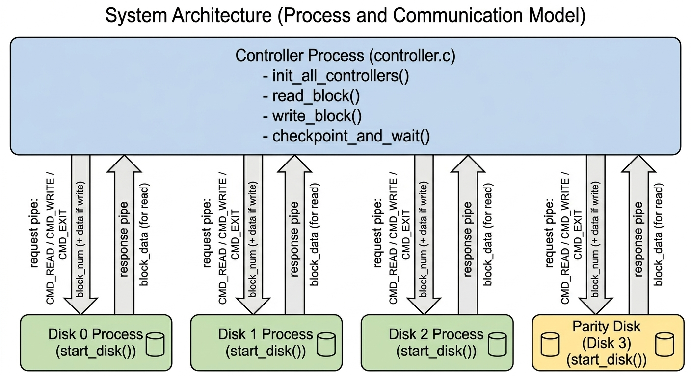
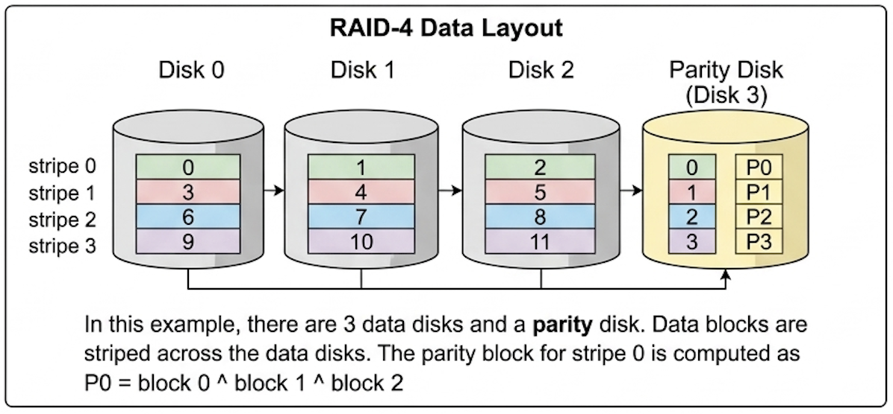

# 5.1 Project Overview
This project implements a simulation of a RAID-4 storage system at the block level. 
It belongs to Category One — Multi-Process Application Using Pipes, and is designed to provide fault tolerance and data reliability by distributing data blocks across multiple disks and maintaining a dedicated parity disk.

The system adopts a controller–worker architecture, where a central controller process manages multiple disk processes, each representing an individual disk. 
The controller coordinates all operations through inter-process communication using pipes, translating high-level RAID commands into low-level disk operations.
Each disk process operates independently and continuously listens for incoming commands such as read, write, and exit. 
Upon receiving a request, the disk executes the corresponding operation and returns the result to the controller, ensuring consistency across the system.

By supporting block-level read and write operations, parity-based recovery, and disk failure simulation, 
the system demonstrates how redundancy, process coordination, and IPC work together to achieve reliable storage in RAID-4 architectures.

## 5.1.1 User Interaction and Interfaces
The main program (`raid_sim.c`) provides an interface for users to interact with the RAID system.

It supports both: **interactive shell-like interface** and **transaction file interface**, 
allowing users to issue commands either manually or through predefined input files.

The system operates on fixed-size data blocks, and all operations are performed at the block level rather than at the file system level.

## 5.1.2 Core Functionality with I/O Behavior
The RAID simulator supports core block-level operations including reads and writes, parity updates, and disk failure simulation, as follows:

- **Write Block (`wb <block_num> <filename>`)**: Reads `block_size` bytes from a local file and writes the data to the specified logical block in the RAID system. 
    This operation also updates the corresponding parity block to maintain consistency.
- **Read Block (`rb <block_num>`)**: Retrieves the data stored in a given logical block and prints it to standard output.
- **Simulate Disk Failure (`kill <disk_num>`)**: Sends a `SIGINT` signal to terminate a disk process, simulating a disk failure scenario.
- **Status (`status`)**: Displays the current state of each disk process, allowing users to check whether a disk is alive or has failed.
- **Exit (`exit`)**: Sends a checkpoint command to all disk processes, causing them to write their data to disk files and terminate gracefully.

These operations collectively demonstrate the behavior of a RAID-4 system. 
In particular, write operations ensure consistency by updating both data and parity blocks, while read operations retrieve data from the appropriate disk. 
When a disk failure occurs, the system can reconstruct lost data using parity information and data from the remaining disks, 
illustrating the fault tolerance mechanism provided by RAID-4.

**Typical Interaction Examples (data disk failure and recovery)**

The system operates under a test configuration (e.g. 3 data disks, 16-byte block size, and 256-byte disk capacity)

Terminal Command: `./raid_sim -n 3 -t simple_test.txt`

| Input | Output |
|------|--------|
| `wb 1 data0.txt` | Block 1 written to RAID (data0.txt: AAAAAAAAAAAAAAAA) |
| `wb 4 data1.txt` | Block 4 written to RAID (data1.txt: BBBBBBBBBBBBBBBB) |
| `kill 1` | disk=1 state=DEAD |
| `status` | disk=0 state=ALIVE disk=1 state=DEAD disk=2 state=ALIVE disk=3 state=ALIVE |
| `rb 1` | Read failed for logical block 1 Failed to read block from RAID |
| `rb 1` | AAAAAAAAAAAAAAAA |
| `rb 4` | BBBBBBBBBBBBBBBB |
| `exit` | (system checkpoints data and terminates all disk processes) |

This example demonstrates the fault tolerance behavior of RAID-4 system. After a disk failure (`kill 1`), the first read attempt fails and triggers recovery. 
Subsequent reads succeed, indicating that the failed disk has been restored and data is correctly reconstructed.

## 5.1.3 Visualization Support(Seen in the YouTube Display Video)
Additionally, a graphical user interface (`RAID-GUI.py`) is provided to visualize the RAID system state and user interactions.
And the system operates under a fixed configuration (3 data disks, 16-byte block size, and 256-byte disk capacity)

The GUI displays the RAID-4 block layout, including how data blocks are striped across disks and how parity is maintained on a dedicated disk. 
It also shows disk status (alive or failed) and highlights read/write operations, allowing users to observe system behavior and 
understand how data and parity are managed during normal operation and failure scenarios.

# 5.2 Build Instructions
The project can be compiled using the provided Makefile. 
No additional dependencies are required beyond a standard C compiler (e.g.`gcc`).

### Compilation
To build the program, run the command: `make`. 
This command compiles all source files (raid_sim.c, controller.c, disk_sim.c) and generate executable files.
To remove compiled files and reset the build environment: `make clean`

### Input Files
The project requires the following input files:

- A transaction file (e.g.`simple_test.txt`) when using the `-t` option. This file contains a sequence of commands to be executed automatically.
- Data files used in write operations (e.g. `data0.txt`, `data1.txt`). These files provide the content written to RAID blocks via the `wb` command.

All input files must be located in the working directory before running the program.

### Running the Program
The RAID simulator can be executed in two modes.

- **Interactive Mode**: Run the program without a transaction file `./raid_sim`.
This starts an interactive shell where users can manually enter commands.

- **Transaction File Mode**: Run the program with a predefined sequence of commands `./raid_sim -n 3 -t simple_test.txt`.
This executes all commands listed in simple_test.txt automatically.

### Command-Line Arguments
The program supports the following optional command arguments:
- -n num_disks: Specifies the number of data disks (default: 3). Note that the system automatically includes one additional parity disk.
- -b block_size: Specifies the size of each block in bytes (default: 16).
- -d disk_size: Specifies the size of each disk in bytes (default: 256).
- -t file_name: Specifies a transaction file containing a sequence of commands.

# 5.3 Architecture Diagram

# 5.4 Communication Protocol

Communication between the RAID controller (parent process) and each disk process (child process) is implemented using two dedicated pipes per disk.
For disk `i`, the controller sends requests through `controllers[i].to_disk[1]` and receives responses from `controllers[i].from_disk[0]`, while the child uses the corresponding opposite ends.

The system supports three disk-level commands: `CMD_READ`, `CMD_WRITE`, and `CMD_EXIT`.
These commands are issued by the controller in response to higher-level RAID operations such as `rb`, `wb`, `kill`, and `exit`.

## 5.4.1 Message Type: Read Request

| Field | Description |
|---|---|
| **Sender and receiver** | Parent (controller) → child disk process |
| **Encoding** | Two fixed-width binary values are written in sequence: first a `disk_command_t` with value `CMD_READ`, then an `int` containing the block number **within that disk**. |
| **Semantics** | The controller converts a logical RAID block number into a target disk and an in-disk block index before sending the request. For a data read, the target disk is `block_num % num_disks`; for a parity read, the target disk is `num_disks`. In both cases, the block number sent to the child is `block_num / num_disks`, i.e., the stripe index. The child must therefore interpret the message as: “read block `disk_block_num` from your local disk image and return exactly `block_size` bytes. |
| **Response** | Child disk process → parent. The child sends back exactly `block_size` bytes containing the requested block data. The parent repeatedly calls `read()` until all `block_size` bytes have been received. |
| **Error handling** | If either write of the request fails with `-1`, the controller treats this as disk failure, calls `restore_disk_process(disk_num)`, and returns failure for the current operation. If the response cannot be read completely (for example, `read()` returns `<= 0` before `block_size` bytes are collected), the operation also fails. |

In the implementation, the controller does **not** send a variable-length message or a packed struct. 
Instead, it sends the message as a small protocol sequence: command opcode first, then block number, then waits for a fixed-size reply. 
This makes it clear to the receiver how many bytes to read and in what order.

## 5.4.2 Message Type: Write Request

| Field                   | Description                                                                                                                                                                                                                                                                                                                                                                                                               |
|-------------------------|---------------------------------------------------------------------------------------------------------------------------------------------------------------------------------------------------------------------------------------------------------------------------------------------------------------------------------------------------------------------------------------------------------------------------|
| **Sender and receiver** | Parent (controller) → child disk process                                                                                                                                                                                                                                                                                                                                                                                  |
| **Encoding**            | Three pieces of data are written in sequence: (1) a `disk_command_t` with value `CMD_WRITE`, (2) an `int` containing the block number within that disk, and (3) exactly `block_size` bytes of payload data.                                                                                                                                                                                                               |
| **Semantics**           | As with reads, the controller first maps the logical RAID block to a specific disk and stripe index. The child must read the command, then read the block number, then read exactly `block_size` bytes and store them in the corresponding block slot of its local disk array. The protocol is position-based: after receiving `CMD_WRITE`, the child knows it must read one integer followed by one full block of bytes. |
| **Response**            | No explicit acknowledgment message is sent back on success. Successful completion is inferred from the fact that all writes to the pipe succeed and the child remains alive.                                                                                                                                                                                                                                              |
| **Error handling**      | If any write operation (command, block number, or payload) returns -1, the controller treats this as a disk failure, invokes `restore_disk_process(disk_num)`, and aborts the current write operation. Short writes or zero-byte progress are also treated as errors. For the block payload, the controller uses a loop to ensure that all `block_size` bytes are eventually written.                                     |

This message type is used both for ordinary data writes and for parity writes. 
Importantly, the disk process itself is unaware of RAID semantics: parity computation is done entirely in the controller, 
which first reads the old data block and old parity block, computes `new_parity = old_parity XOR old_data XOR new_data`, 
writes the updated parity block, and then writes the new data block. 
Thus, the protocol seen by the child remains a simple block-write protocol.

## 5.4.3 Message Type: Exit / Checkpoint Request

| Field | Description |
|---|---|
| **Sender and receiver** | Parent (controller) → child disk process |
| **Encoding** | A single fixed-width binary value of type `disk_command_t` with value `CMD_EXIT`. No additional fields follow. |
| **Semantics** | Upon receiving `CMD_EXIT`, the disk process exits its command-processing loop. After exiting the loop, it checkpoints its current disk contents to a file (e.g., `disk_X.dat`) and then terminates. Since the command carries no payload, the receiver knows that the message ends immediately after the command value. |
| **Response** | No explicit data response is required. The controller observes termination by waiting for all child processes using `wait()`. |
| **Error handling** | In `checkpoint_and_wait()`, if sending `CMD_EXIT` to a disk fails (e.g., `write()` does not return the expected number of bytes), the controller prints a warning and continues the shutdown process. As this occurs during final cleanup, such failures are treated as non-fatal. |

At the user level, the `exit` command causes the controller to send `CMD_EXIT` to all disk processes and wait for their termination.

## 5.4.4 Failure-Triggered Recovery as Part of the Protocol

Although disk recovery is not encoded as a separate pipe message type, it is an integral part of the communication protocol.
In this design, communication failure is used as the mechanism for detecting disk failure.

The controller explicitly ignores `SIGPIPE`, ensuring that a failed disk process does not terminate the entire system.
Instead, when a `write()` to a disk pipe returns `-1`, the controller interprets this as a disk failure. It then closes the corresponding pipe endpoints,
restarts the disk process using `restart_disk()`, and reconstructs the missing data.

Recovery is performed stripe by stripe using the parity relation. For a failed data disk, each missing block is reconstructed by XORing
the parity block with all remaining data blocks in the same stripe. For a failed parity disk, each parity block is recomputed by XORing
all data blocks in the stripe. This recovery logic is implemented in `restore_disk_process()`.

## 5.4.5 Summary

Overall, the protocol is a compact, opcode-driven binary protocol over pipes.
Each message is self-delimiting, as the command opcode determines both the structure and length of the remaining fields.
This design simplifies the disk processes, enables natural synchronization through blocking I/O,
and tightly integrates failure detection into the communication layer.

## 5.5 Concurrency Model

This project uses the Category One multi-process model, where a parent process manages multiple worker processes using pipes.

**Process Creation**  
The parent process in `controller.c` creates all disk processes during initialization in `init_all_controllers()`. It calls `init_disk(i)` for each disk, where two pipes (`to_disk` and `from_disk`) are created and `fork()` is executed. Each child process then starts execution in `start_disk()` and represents one disk.

**Worker Readiness**  
There is no explicit ready signal. After `fork()`, each child process enters `start_disk()` and immediately waits for commands by reading from its pipe. Since the child is already blocked waiting for input, the parent can assume that all workers are ready once they have been successfully created.

**Concurrent Execution**  
All disk processes run independently as separate processes. They remain active throughout execution, while the parent coordinates disk operations through functions such as `read_block_from_disk()` and `write_block_to_disk()`.

**Communication and Synchronization**  
Communication is handled through pipes using `read_block_from_disk()` and `write_block_to_disk()`.
- In `read_block_from_disk()`, the parent sends `CMD_READ` and a block number through `to_disk`, then reads the result from `from_disk`.
- In `write_block_to_disk()`, the parent sends `CMD_WRITE`, the block number, and the data block through `to_disk`.

On the child side, `start_disk()` continuously reads commands from the pipe and executes them. Because both sides follow a fixed read/write order, pipes ensure that commands are processed in the correct order without additional synchronization.

**Process Collection**  
Child processes are collected in `checkpoint_and_wait()`. The parent sends `CMD_EXIT` to each disk process and then calls `wait()` once per child to ensure that all processes terminate correctly. In failure cases, `simulate_disk_failure()` uses `waitpid()` to collect a specific disk process.

Overall, concurrency is achieved by maintaining multiple disk processes, while the parent process coordinates their execution through well-defined functions and pipe-based communication.

# 5.6 Error Handling and Robustness

Our implementation includes explicit error checking for system calls and pipe-based communication. Since the RAID simulator is built as a multi-process application using pipes, many runtime failures can occur at the operating-system level. The controller handles these failures by checking return values, printing diagnostic messages with `perror()` or `fprintf(stderr, ...)`, closing invalid file descriptors when necessary, and returning `-1` so that the caller can stop or recover safely.

Below are several examples of bad runtime behaviours and how the code handles them.

## 5.6.1. Resource initialization failure (pipe and fork)

**Bad behaviour:**  
A system call used to create a disk process may fail while the controller is setting up or recreating a disk. 
In particular, either `pipe()` may fail when creating the `to_disk` / `from_disk` communication channels, or `fork()` may fail when creating the child disk process.

**How the code handles it:**  
This case is handled in both `init_disk()` and `restart_disk()`. 
Each function first creates `controllers[num].to_disk`, then `controllers[num].from_disk`, and checks the return value of each `pipe()` call immediately. 
If the first `pipe()` fails, the function reports the error with `perror()` and returns `-1`. 
If the second `pipe()` fails, the code closes both ends of the first pipe before returning, so the controller does not keep half-initialized communication channels open. 
After both pipes succeed, the code calls `fork()` and checks whether the returned PID is negative. 
If `fork()` fails, it reports the error with `perror()`, closes all four pipe descriptors for that disk (`to_disk[0]`, `to_disk[1]`, `from_disk[0]`, and `from_disk[1]`), 
and returns `-1` instead of continuing. Only when both pipes and `fork()` succeed does the parent store `controllers[num].pid` and keep the intended pipe ends open for normal controller–disk communication.

**Why this is robust:**  
This prevents the controller from continuing with partially created pipes or a missing child process, and it avoids leaking file descriptors during disk initialization or restart.

## 5.6.2. Writing to a closed or broken pipe

**Bad behaviour:**  
After a disk process is terminated (via `simulate_disk_failure()`), 
the controller may still attempt to send a read or write request to that disk through its pipe. 
Since the disk process no longer exists, the read end of the pipe is closed, 
and any subsequent `write()` to `controllers[disk_num].to_disk[1]` results in a broken pipe.

**How the code handles it:**  
The controller explicitly ignores `SIGPIPE` using `ignore_sigpipe()`, preventing the entire process from being terminated by the operating system when writing to a closed pipe. 
Instead, `write()` returns `-1`, which is checked in both `read_block_from_disk()` and `write_block_to_disk()`. 
When such a failure is detected, the code immediately calls `restore_disk_process(disk_num)` to restart the failed disk process and reconstruct its data using RAID-4 parity recovery. 
The function then returns an error to signal that the current operation did not complete successfully.

**Why this is robust:**  
This approach converts a potentially fatal runtime error (broken pipe) into a recoverable event. 
By combining signal handling, explicit error detection, and automatic disk restoration, 
the system avoids crashing and maintains data consistency even when a disk process fails.

## 5.6.3. Malformed or incomplete command over a pipe

**Bad behaviour:**  
A disk process may receive a malformed command from the controller. 
This can occur if the command is only partially transmitted through the pipe (e.g., due to communication interruption or premature pipe closure), 
or if the received command value does not correspond to any valid operation (`CMD_READ`, `CMD_WRITE`, or `CMD_EXIT`).

**How the code handles it:**  
In `start_disk()`, the disk process reads commands using the helper function `read_full()`, which repeatedly calls `read()` until either the expected number of bytes is received or an error/EOF occurs. 
After the read, the code checks whether the number of bytes read equals `sizeof(cmd)`. 
If the read is incomplete, reaches EOF, or fails, the disk reports an error and stops processing further requests. 
If a full command is received, the code validates it using a `switch(cmd)` statement. 
Any unrecognized command is handled in the `default` branch, which reports an "Unknown command" error and terminates the request loop safely.

**Why this is robust:**  
This approach ensures that the disk process never executes a partially received or invalid command. 
By validating both the completeness of the data (via `read_full()`) and 
the correctness of the command value (via `switch(cmd)`), the system prevents undefined behavior and fails safely when the controller–disk communication protocol is violated.

## 5.6.4. Partial or failed transfer of block data over a pipe

**Bad behaviour:**  
Even when a disk process is still running and the command itself is valid, a full RAID block may not be transferred in a single `read()` or `write()` call. 
This means the controller could receive or send only part of the `block_size` bytes for a block, which would make the block contents incomplete.

**How the code handles it:**   
This case is handled in `read_block_from_disk()` and `write_block_to_disk()`. 
Function `read_block_from_disk()` repeatedly reads from the pipe until `bytes_read_total` reaches `block_size`, instead of assuming one `read()` is enough. 
If `read()` returns `<= 0`, it reports an error and returns `-1`. 
Function `write_block_to_disk()` uses the same strategy for block data writes, it loops until `bytes_written_total` reaches `block_size`, and if `write()` fails, 
it reports the error and returns `-1` (calling `restore_disk_process(disk_num)` when `write()` returns `-1`).

**Why this is robust:**
This ensures that only complete blocks of size `block_size` are processed, preventing partial transfers from being treated as valid data.

## 5.6.5. Invalid logical block number supplied to a RAID operation

**Bad behaviour:**  
A caller may request a read or write using a logical block number outside the valid RAID data range. 
Since logical block numbers refer only to data blocks (not the parity disk), 
an out-of-range value would lead to an invalid mapping from a logical block to a data disk and stripe position.

**How the code handles it:**  
This case is handled in both `write_block()` and `read_block()`. 
In each function, the controller first computes `blocks_per_disk` and `total_logical_blocks`, 
then checks whether `block_num` lies in the valid range `[0, total_logical_blocks)`. 
If the value is invalid, the code logs an error (`"Invalid logical block number for write"` or `"Invalid logical block number for read"`) 
and immediately returns without sending any command to a disk process. 
As a result, no invalid disk index, stripe calculation, or pipe communication is performed for an out-of-range request.

**Why this is robust:**  
This prevents malformed RAID requests from propagating into the controller–disk communication layer. 
By rejecting invalid logical block numbers early, the code avoids incorrect disk selection, invalid stripe offsets, and unnecessary child-process communication.

## 5.6 Conclusion

The RAID system handles failures at multiple levels, including resource initialization, inter-process communication, data transfer, and input validation. 
By consistently checking system call return values, cleaning up resources on failure, and preventing invalid operations from propagating to disk processes, 
the design ensures that failures are detected early and handled safely. 

# 5.7 Project Contributions

This project was completed individually. All core system design, implementation, testing, and documentation were carried out by the author.
